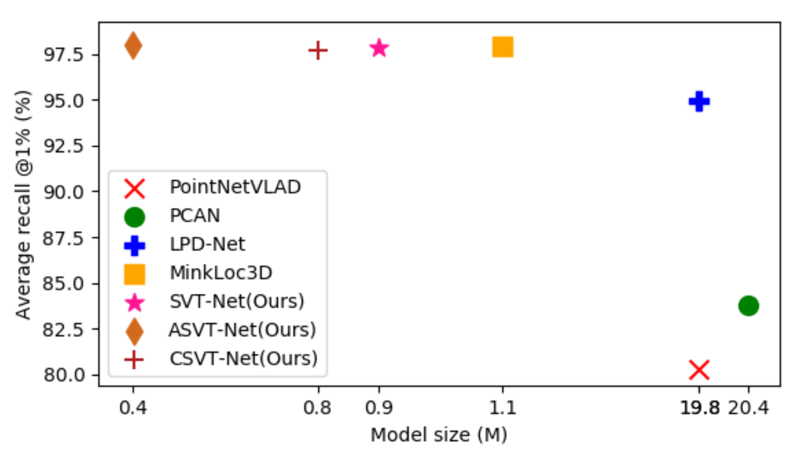

# SVT-Net:  A Super Light-Weight Network  for Large Scale Place Recognition using Sparse Voxel Transformers




### Abstract
Simultaneous Localization and Mapping (SLAM) and Autonomous Driving are becoming increasingly more important in recent years. Point cloud-based large scale place recognition is the spine of them. While many models have been proposed and have achieved acceptable performance by learning short-range local features, they always skip long-range contextual properties. Moreover, the model size also becomes a serious shackle for their wide applications. To overcome these challenges, we propose a super light-weight network model termed SVT-Net. On top of the highly efficient 3D Sparse Convolution (SP-Conv), an Atom-based Sparse Voxel Transformer (ASVT) and a Cluster-based Sparse Voxel Transformer (CSVT) are proposed respectively to learn both short-range local features and long-range contextual features. Consisting of ASVT and CSVT, SVT-Net can achieve state-of-the-art performance in terms of both recognition accuracy and running speed with a super-light model size (0.9M parameters). Meanwhile, for the purpose of further boosting efficiency, we introduce two simplified versions, which also achieve state-of-the-art performance and further reduce the model size to 0.8M and 0.4M respectively.


### Environment and Dependencies
The code is developed based on the MinkLoc3D project. The proposed model is provided under the 'models' folder.

1\. Code was tested using Python 3.8 with PyTorch 1.7 and MinkowskiEngine 0.5.2 on Ubuntu 18.04 with CUDA 10.2.
The following Python packages are required:
* PyTorch (version 1.7)
* MinkowskiEngine (version 0.5.2)
* pytorch_metric_learning (version 0.9.94 or above)
* tensorboard
* pandas
* psutil
* bitarray

2\. Download the MinkLoc3D project
```
git clone https://github.com/jac99/MinkLoc3D.git
```
Please refer to MinkLoc3D README for more details

3\. Modify the `PYTHONPATH` environment variable to include absolute path to the project root folder: 
```export PYTHONPATH
export PYTHONPATH=$PYTHONPATH:/your_path_to/MinkLoc3D
```

4\. replace the models in the original MinkLoc3D folder
```
cp -r models /your_path_to/MinkLoc3D
``` 

5\. go to the MinkLoc3D folder
```
cd /your_path_to/MinkLoc3D
```


### Datasets
Same setup as MinkLoc3D, please refer to MinkLoc3D README for more details.


### Training
Same setup as MinkLoc3D, using different model configures.

To train the network, run:

```train baseline
cd training

# To train minkloc3d model on the Baseline Dataset
python train.py --config ../config/config_baseline.txt --model_config ../models/minkloc3d_att.txt

# To train minkloc3d model on the Refined Dataset
python train.py --config ../config/config_refined.txt --model_config ../models/minkloc3d_att.txt
```


### Evaluation

To evaluate pretrained models run the following commands:

```eval baseline
cd eval

# To evaluate the model trained on the Baseline Dataset
python evaluate.py --config ../config/config_baseline.txt --model_config ../models/minkloc3d_att.txt --weights ../weights/model_MinkFPN_token_GeM_final.pth

```
### Cite
```cite
@inproceedings{fan2022svt,
    author      =   {Fan, Zhaoxin and Song, Zhenbo and Liu, Hongyan and Lu, Zhiwu and He, Jun and Du, Xiaoyong},
    title       =   {SVT-Net: Super Light-Weight Sparse Voxel Transformer for Large Scale Place Recognition.},
    booktitle   =   {Proceedings of the AAAI Conference on Artificial Intelligence},
    volume      =   {36(1)},
    pages       =   {551-560.},
    year        =   {2022}
}
```

